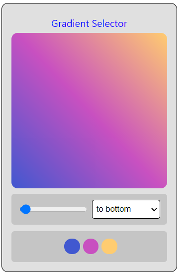

# BgGradientColor
<p align="center"></p>


# How To Use ?
```
  # add css tag to head
  
  ***
 
  <link rel="stylesheet" href="BggradientColor.css">
  
  ***
  # Add div tag to body 
  
  ***
  
  <div class="BgGradientColor"></div>
  
  ***
  
  # Add Script tag to body
  
  ***
  <script src="https://code.jquery.com/jquery-3.6.0.min.js" integrity="sha256-/xUj+3OJU5yExlq6GSYGSHk7tPXikynS7ogEvDej/m4=" crossorigin="anonymous"></script>
  <script src="BgGradientColor.js"></script>
     $(".BgGradientColor").BgGradientColor({
        items:3,
        defaultbgcolor:"-webkit-linear-gradient(43deg,#4158D0,#C850C0,#FFCC70)",
        title:null,
        select:true,
        radiusselect:true,
        locale:'en'   
    })

***

```
